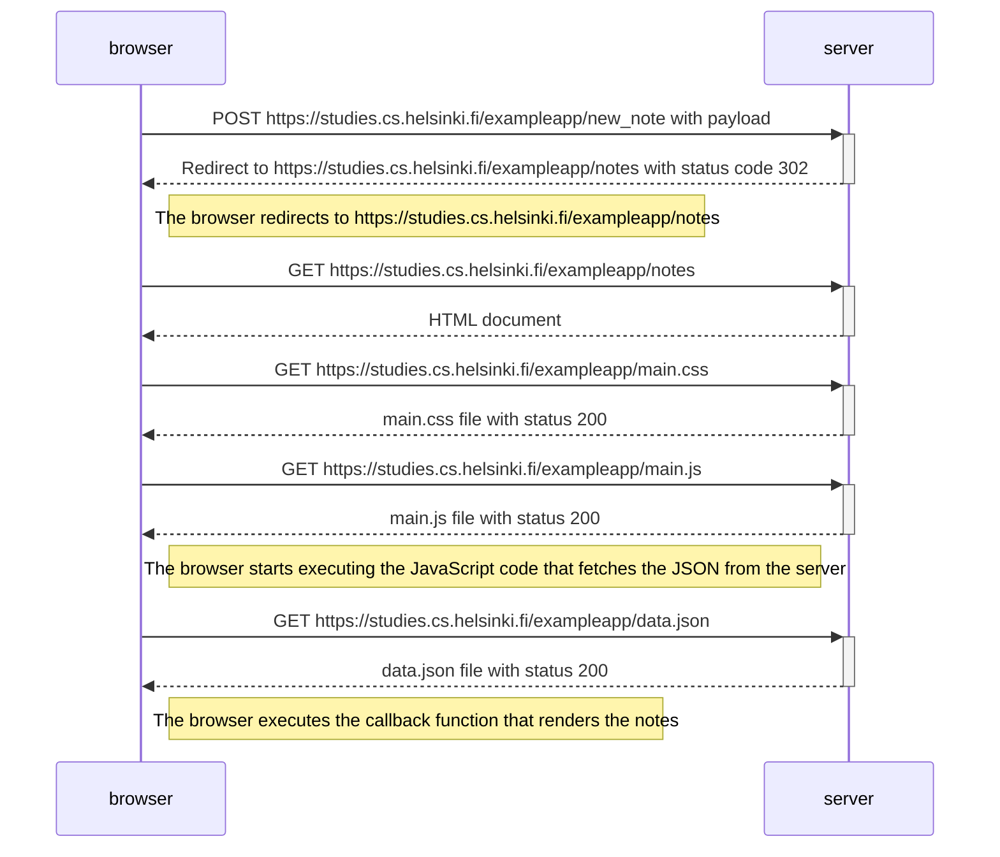

```mermaid
sequenceDiagram
    browser->>+server: POST https://studies.cs.helsinki.fi/exampleapp/new_note with payload
    server-->>-browser: Redirect to https://studies.cs.helsinki.fi/exampleapp/notes with status code 302
    
    Note right of browser: The browser redirects to https://studies.cs.helsinki.fi/exampleapp/notes 

    browser->>+server: GET https://studies.cs.helsinki.fi/exampleapp/notes
    server-->>-browser: HTML document
    
    browser->>+server: GET https://studies.cs.helsinki.fi/exampleapp/main.css
    server-->>-browser: main.css file with status 200
    
    browser->>+server: GET https://studies.cs.helsinki.fi/exampleapp/main.js
    server-->>-browser: main.js file with status 200
    
    Note right of browser: The browser starts executing the JavaScript code that fetches the JSON from the server

    browser->>+server: GET https://studies.cs.helsinki.fi/exampleapp/data.json
    server-->>-browser: data.json file with status 200

    Note right of browser: The browser executes the callback function that renders the notes
```
