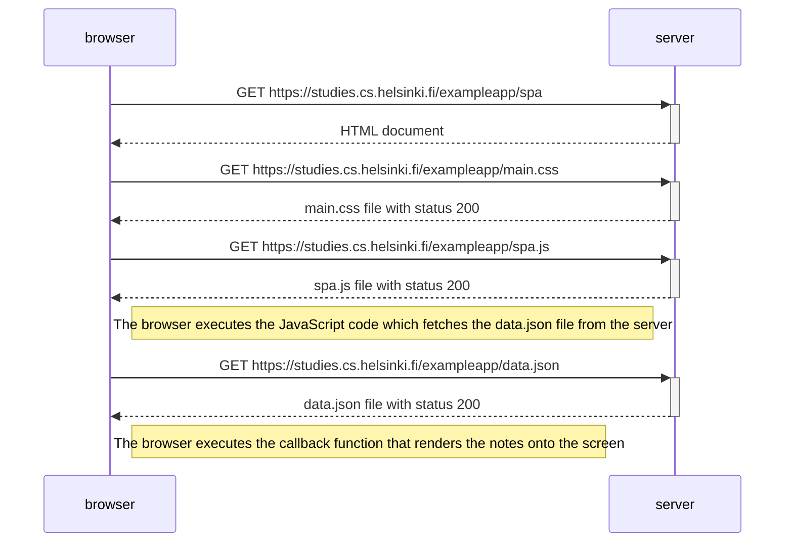

```mermaid
sequenceDiagram
    browser->>+server: GET https://studies.cs.helsinki.fi/exampleapp/spa
    server-->>-browser: HTML document
    
    browser->>+server: GET https://studies.cs.helsinki.fi/exampleapp/main.css
    server-->>-browser: main.css file with status 200
    
    browser->>+server: GET https://studies.cs.helsinki.fi/exampleapp/spa.js
    server-->>-browser: spa.js file with status 200
    
    Note right of browser: The browser executes the JavaScript code which fetches the data.json file from the server

    browser->>+server: GET https://studies.cs.helsinki.fi/exampleapp/data.json
    server-->>-browser: data.json file with status 200

    Note right of browser: The browser executes the callback function that renders the notes onto the screen
```
