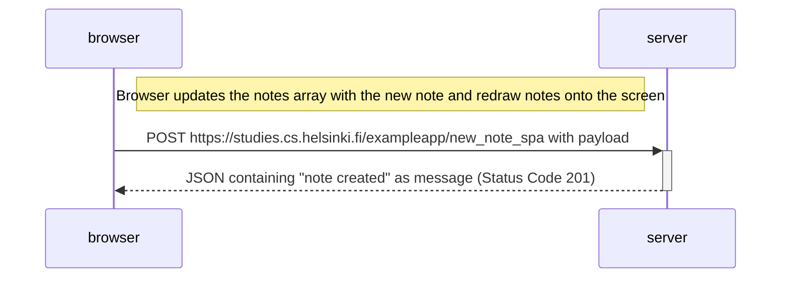

```mermaid
sequenceDiagram
    Note right of browser: Browser updates the notes array with the new note and redraw notes onto the screen
    browser->>+server: POST https://studies.cs.helsinki.fi/exampleapp/new_note_spa with payload 
    server-->>-browser: JSON containing "note created" as message (Status Code 201) 
```
